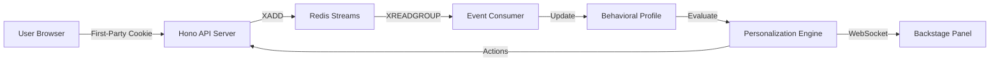
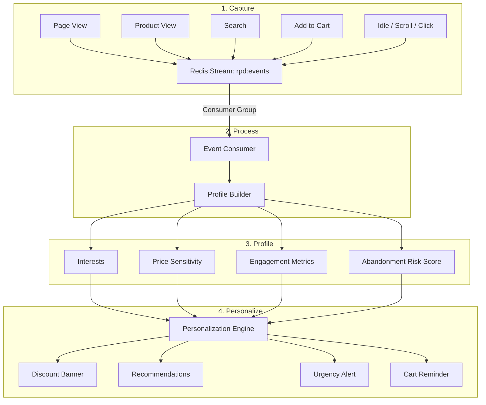
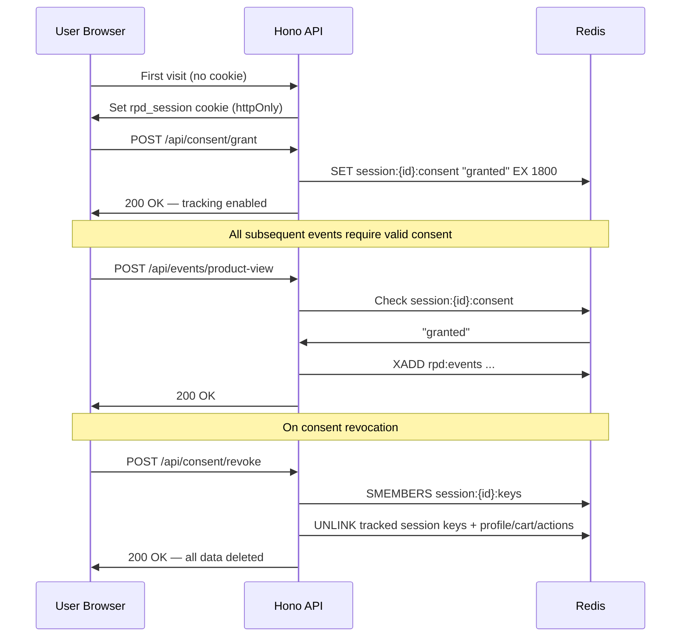
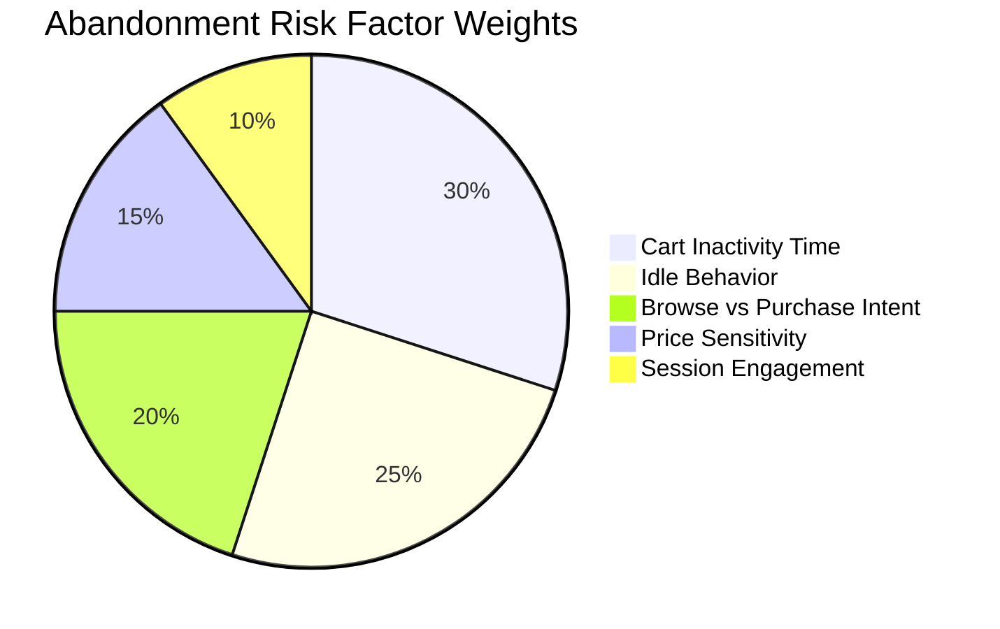
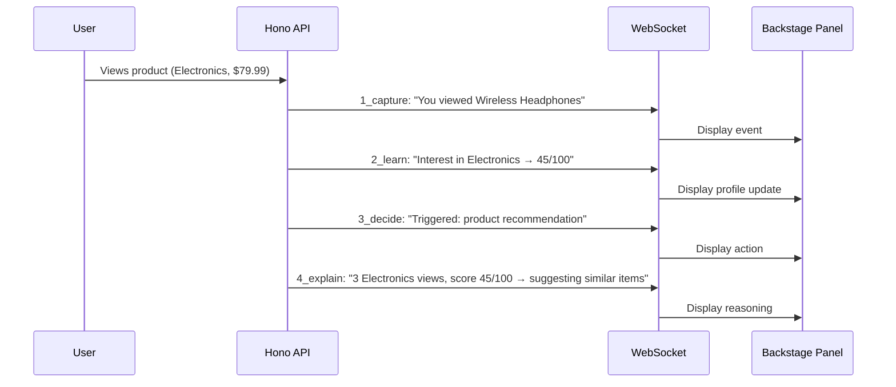
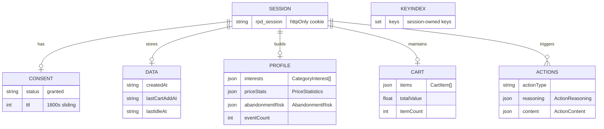
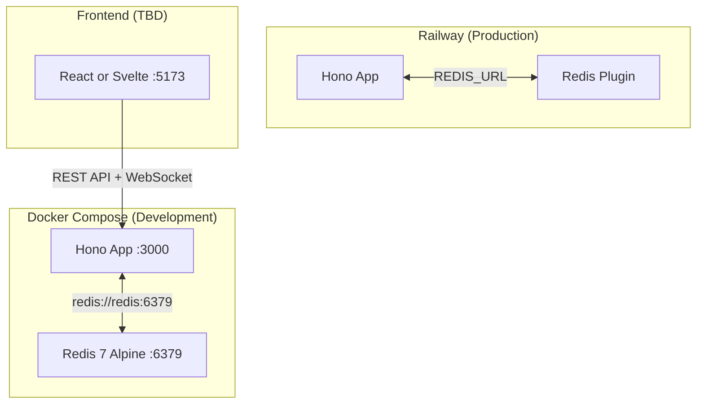

# RPD — System Architecture

## Overview

RPD is an event-driven e-commerce personalization system that demonstrates how first-party cookies enable real-time, privacy-respecting personalization. The architecture follows a pipeline model: **Capture → Process → Profile → Personalize → Explain**.

---

## Data Flow Pipeline

The system processes user behavior through four stages, each visible in the Backstage panel:

---

## Consent & Session Flow

No tracking occurs until the user grants explicit consent (GDPR compliance).

Session TTL policy is sliding: session-scoped keys are refreshed to 30 minutes on tracked activity.

---

## Cart Abandonment Risk Algorithm

Explainable weighted scoring model (0–100):

| Factor | Weight | Signal | High Risk Indicator |
| --- | --- | --- | --- |
| Cart Inactivity | 0.30 | Time since last cart action | > 10 minutes |
| Idle Behavior | 0.25 | Idle duration detected | > 60 seconds |
| Browse vs Purchase | 0.20 | Views without cart adds | High view count, empty cart |
| Price Sensitivity | 0.15 | Average price viewed | Budget range (< $50 avg) |
| Session Engagement | 0.10 | Event count, scroll depth | Low interaction count |

**Risk levels:** Low (0–35) · Medium (36–60) · High (61–100)

---

## Backstage Panel — Real-Time Transparency

The WebSocket-based Backstage panel streams explanations at each pipeline stage:

---

## Redis Data Model

All session-scoped keys enforce a 30-minute sliding TTL for GDPR compliance and active-session continuity.

**Key patterns:**

| Key | Type | TTL | Description |
| --- | --- | --- | --- |
| `session:{id}:consent` | String | 30min | Consent status |
| `session:{id}:data` | Hash | 30min | Session metadata |
| `session:{id}:keys` | Set | 30min | Session-owned key index for revoke cleanup |
| `profile:{id}` | String (JSON) | 30min | Behavioral profile |
| `cart:{id}` | String (JSON) | 30min | Shopping cart |
| `action:{actionId}` | String (JSON) | 30min | Individual action |
| `actions:{id}` | List | 30min | Action history |
| `rpd:events` | Stream | — | Event stream (consumer group) |

`cart_abandon` is treated as a derived internal signal from cart inactivity + idle behavior, not a client-facing event endpoint.

## Stream Reliability

The event pipeline uses at-least-once processing with idempotent reducers:

- `XREADGROUP` for primary consumption
- `XAUTOCLAIM` to recover stale pending entries after worker restart/crash
- `XACK` only after profile/action persistence succeeds
- Per-session dedupe marker for processed stream IDs
- `XTRIM` retention policy to bound stream growth

---

## Infrastructure

---

## Technology Stack

| Layer | Technology | Purpose |
| --- | --- | --- |
| Backend | Hono | Lightweight HTTP framework |
| Runtime | Node.js 20 | Server runtime |
| Language | TypeScript | Type safety |
| Data Store | Redis 7 | Streams, profiles, sessions |
| Validation | Zod | Request schema validation |
| Real-time | WebSocket | Backstage panel streaming |
| Containers | Docker Compose | Development environment |
| Hosting | Railway | Production deployment |
| Frontend | TBD (React/Svelte) | User interface |
